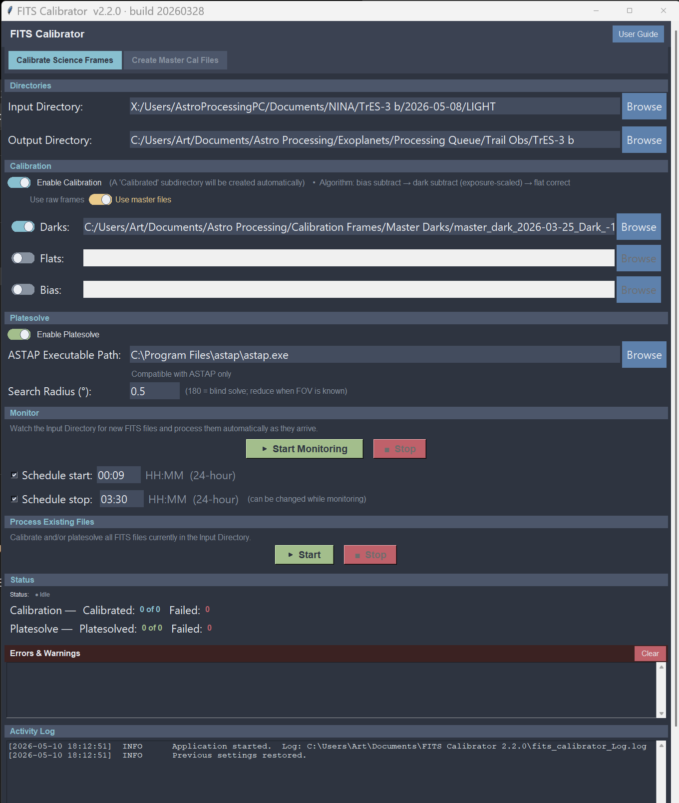

# FITS Calibrator

A Python/Tkinter desktop application for automated FITS image calibration and plate-solving for astrophotography workflows.



## Features

- **Calibrate Science Frames** — applies bias subtraction, dark subtraction (exposure-scaled), and flat correction to raw FITS images
- **Create Master Cal Files** — build master bias, dark, and flat frames from sets of calibration frames
- **Plate-solving** via [ASTAP](https://www.hnsky.org/astap.htm) — automatically solves WCS coordinates for each calibrated frame
- **Monitor mode** — watches an input directory and processes new FITS files automatically as they arrive, with optional scheduled start/stop times
- **Process Existing Files** — one-shot batch calibration/plate-solving of all FITS files currently in the input directory
- **Flexible calibration inputs** — use raw calibration frames or pre-built master files
- **Live status counters** — tracks calibrated, plate-solved, and failed file counts per session
- **Settings persistence** — all paths and options saved automatically between sessions

## Requirements

- Windows 10/11
- Python 3.10+ with the following packages:
  - `astropy`
  - `numpy`
  - `watchdog`
- [ASTAP](https://www.hnsky.org/astap.htm) (optional, required for plate-solving)

## Installation

```bash
pip install astropy numpy watchdog
python fits_solver.py
```

Or use the included `FITS Calibrator.bat` launcher.

## Building the Executable

Requires [PyInstaller](https://pyinstaller.org/):

```bash
pip install pyinstaller
pyinstaller "FITS Calibrator 2.2.0.spec"
```

The onedir build will be created in the `dist/` folder.

## Usage

1. Set the **Input Directory** (folder containing your raw FITS light frames).
2. Set the **Output Directory** (calibrated files are written to a `Calibrated/` subdirectory inside this folder).
3. Under **Calibration**, enable calibration and select your dark, flat, and/or bias files (or master files).
4. Under **Platesolve**, enable plate-solving and point to your ASTAP executable.
5. Use **Start Monitoring** to watch for new files, or **Process Existing Files** to batch-process what's already in the input directory.

## Pipeline

```
Input Dir → Calibrated/image_CAL.fits → Calibrated/image_CAL_WCS.fits
```

## Version History

| Version | Date       | Notes                                      |
|---------|------------|--------------------------------------------|
| 2.2.0   | 2026-03-28 | Added "Use master files" toggle; UI sizing improvements |
| 2.1.x   | 2026       | Plate-solve integration, schedule stop     |
| 2.0.0   | 2026       | Full rewrite with Monitor + batch modes    |

## License

MIT License — © Art Trail 2026. See [LICENSE](LICENSE) for details.
